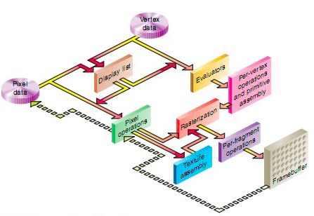

# 关于OpenGL

#### OpenGL渲染管线顺序图

### 基于顶点的操作与基本装配（Per-vertex operations and primitive assembly）

- Vertex shader

### 片段测试和操作（Per-fragment operations）
- Fregment shader
- 裁剪测试
- alpha测试
- 模版测试
- 深度测试
- 混合
- 抖动
- 逻辑操作

### glMatrixMode()
- GL_TEXTURE 之后对纹理矩阵操作
- GL_MODELVIEW 之后对模型视景矩阵操作，例如gluLookAt()
- GL_PROJECTION 之后对投影矩阵操作，例如glFrustum()或gluPerspective()

