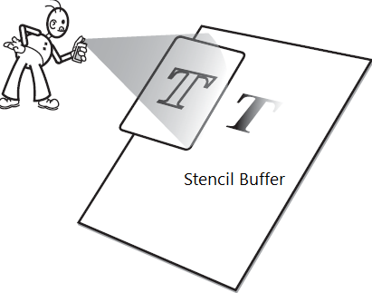
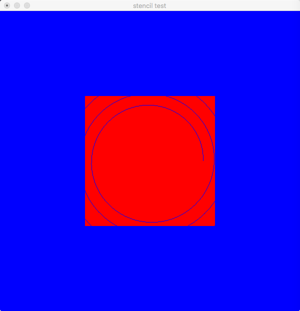

# OpenGL：模版缓冲区

#### 模版缓冲区(Stencil Buffer): 

与颜色缓冲区和深度缓冲区类似，模板缓冲区可以为屏幕上的每个像素点保存一个无符号整数值。在渲染的过程中，可以用这个值与一个预先设定的参考值相比较，根据比较的结果来决定是否更新相应的像素点的颜色值。这个比较的过程被称为模板测试。模板测试发生在透明度测试（alpha test）之后，深度测试（depth test）之前。如果模板测试通过，则相应的像素点更新，否则不更新。就像使用纸板和喷漆一样精确的混图一样，当启动模板测试时，通过模板测试的片段像素点会被替换到颜色缓冲区中，从而显示出来，未通过的则不会保存到颜色缓冲区中，从而达到了过滤的功能。下图描述了模版缓冲区的原理：




#### 相关函数
	// 默认模版缓冲区并未开启，需使用glEnable开启
	glEnable(GL_STENCIL_TEST);
	
	// 设置模版缓冲区的掩码， 当glDisable(GL_STENCIL_TEST)时禁止向stencil buffer写入掩码
	glStencilMask(oxFF);
	
	// 设置stencil buffer的值为value, 默认值为0
	glClearStencil(value);
	
	// 设置模版测试函数
	glStencilFunc(GLenum func, GLint ref, GLuint mask);
	
	// 设置模版测试之后对于stencil buffer的操作
	glStencilOp(GLenum fail, GLenum zfail, GLenum zpass);
	
	// 清除stencil buffer
	glClear(GL_STENCIL_BUFFER_BIT);


### 示例（图如下）




#### 完整的代码如下：

```
#include <stdio.h>
#include <math.h>
#include <OpenGL/OpenGL.h>
#include <OpenGL/glu.h>
#include <GLUT/GLUT.h>

void init()
{
    glClearColor(0.0, 0.0, 1.0, 0.0);
    glClearStencil(0);
    glEnable(GL_STENCIL_TEST);
}

void display()
{
    glClear(GL_COLOR_BUFFER_BIT|GL_DEPTH_BUFFER_BIT|GL_STENCIL_BUFFER_BIT);
    
    glLoadIdentity();
    glTranslatef(0.0, 0.0, -20);
    
    //glStencilFunc(GL_ALWAYS, 0, 0x00);
    
    /*
    背景清除为蓝色，并设置模版测试从不通过，测试之后stencil buffer加1，所以以下的glBegin和glEnd之前的绘制不会出现在屏幕上。
    */
    glStencilFunc(GL_NEVER, 0x0, 0x0);
    glStencilOp(GL_INCR, GL_INCR, GL_INCR);
    
    glColor3f(1.0f, 1.0f, 1.0f);
    
    float dRadius = 5.8 * (sqrt(2.0) / 2.0);
    glBegin(GL_LINE_STRIP);
    for(float dAngle = 0; dAngle < 380.0; dAngle += 0.1)
    {
        glVertex2d(dRadius * cos(dAngle), dRadius * sin(dAngle));
        dRadius *= 1.003;
    }
    glEnd();
    
    /*
    再次设置模版测试stencil buffer中的值不为1的时候通过，即绘出图形，经过上面的测试，stencil buffer 中曲线
    位置上的值为1， 之前有曲线的地方是不会通过测试就显示出原来的蓝线的线，而不是glColor3f(1.0f, 1.0f, 1.0f)
    之后的白色。
    */
    glStencilFunc(GL_NOTEQUAL, 0x1, 0x1);
    glStencilOp(GL_INCR, GL_INCR, GL_INCR);
    
    glColor3f(1.0f, 0.0f, 0.0f);
    glRectf(-5, -5, 5, 5);
    
    glutSwapBuffers();
}

void reshape(int w, int h)
{
    glViewport(0, 0, w, h);
    float aspect = (w * 1.0)/h;
    glMatrixMode(GL_PROJECTION);
    glLoadIdentity();
    gluPerspective(60, aspect, 1, 100);
    
    glMatrixMode(GL_MODELVIEW);
    glLoadIdentity();
}

int main(int argc, char* argv[])
{
    glutInit(&argc, argv);
    glutInitDisplayMode(GLUT_DOUBLE|GLUT_RGBA|GLUT_STENCIL);
    glutInitWindowPosition(200, 200);
    glutInitWindowSize(600, 600);
    glutCreateWindow("stencil test");
    
    init();
    glutReshapeFunc(reshape);
    glutDisplayFunc(display);
    glutMainLoop();
    return 0;
}
```
